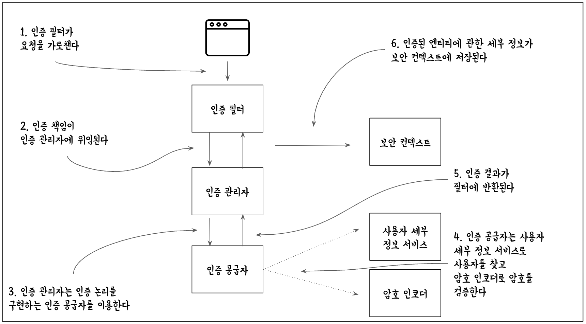

## 스프링 시큐리티 실습 회고

> spring-security-arch



`ch2-ex1`

  + HTTP Basic 인증을 통한 엔드포인트 호출
  + curl 명령을 .http 파일로 작성하는 방법

`ch2-ex2`

  + UserDetailsService, PasswordEncoder 스프링 컨텍스트에 등록
  + 자동으로 구성되는 Bean 확인

```
Tip.
디렉토리 별로 존재하는 Main 클래스를 동작하기 위해서 각 디렉토리 별 maven 빌드가 필요

+ 코드 변경이 있을 경우 다시 maven 빌드를 진행해야 변경된 코드를 수행함
+ gradle 빌드를 사용할 때는 코드 변경 후 다시 gradle 빌드 진행하지 않고 재실행만 해도 반영되었는 데...
```

`ch2-ex3`

  + UserDetailsService, PasswordEncoder 스프링 컨텍스트에 등록하지 않는 방법
  + configure(AuthenticationManagerBuilder) 메서드 사용
  + 같은 동작을 하지만 다르게 구성하는 방법 확인

```
Tip.
스프링 시큐리티에 유연함을 남용하는 안좋은 예시

+ configure(AuthenticationManagerBuilder) 메서드에서 직접 UserDetailsService 구성 및 PasswordEncoder 빈으로 설계
+ 깔끔하고 이해하기 쉬운 코드를 위해서는 혼합하지 않아야 한다
```

`ch2-ex4`

  + 책임을 분리하지 않는 권장하지 않는 예시
  + 인-메모리 사용자를 위한 구성 configure(AuthenticationManagerBuilder) 메서드를 사용
  + AuthenticationManagerBuilder 객체에 직접 인-메모리 유저,비밀번호,권한 설정 및 PasswordEncoder 적용
  + 애플리케이션의 책임을 분리해서 작성하는 것이 좋다

`ch2-ex5`

  + 인증 구현을 재정의할 때도 스프링 시큐리티 아키텍처의 설계를 따르는 것이 좋다
  + AuthenticationProvider 기본 구현이 애플리케이션의 요구 사항에 완전히 맞지 않으면 맞춤형 인증 논리를 구현할 수 있다
  + authenticate() 메서드 내부에 if-else 절의 조건은 UserDetailsService 및 PasswordEncoder의 책임을 대체한다

`ch2-ex6`

  + 운영 애플리케이션은 예제보다는 복잡한 선언이 포함될 가능성이 높다
  + 프로젝트를 이해하기 쉽게 만들기 위해 둘 이상의 구성 클래스를 만드는 것이 좋다 (항상 한 클래스가 하나의 책임을 맡도록 하는 것이 바람직)

```
Tip.
UserManagementConfig custom class: 사용자 관리와 암호 관리를 위한 구성 클래스
WebAuthorizationConfig custom class: 권한 부여 관리를 위한 구성 클래스

두 클래스 모두 WebSecurityConfigurerAdapter를 확장할 수 없다. 그렇게 하면 종속석 주입이 실패
@Order 어노테이션으로 주입 우선순위를 설정하면 종속성 문제는 해결할 수 있지만 구성이 병합되지 않고 서로를 제외하므로 기능상 작동 안함
```

`ch2 요약`

  + 스프링 시큐리티를 애플리케이션의 종속성으로 추가하면 스프링 부트가 약간의 기본 구성을 제공한다
  + 인증관 권한 부여를 위한 기본 구성 요소인 UserDetailService, PasswordEncoder, AuthenticationProvider 구현했다
  + User 클래스로 사용자를 정의할 수 있다. 사용자는 사용자 이름, 암호, 권한을 가져야 한다. 권한은 사용자가 애플리케이션의 컨텍스트에서 수행할 수 있는 작업을 지정한다
  + 스프링 시큐리티는 UserDetailsService의 간단한 구현인 InMemoryUserDetailsManager를 제공한다. UserDetails Service의 인스턴스와 같은 사용자를 추가해서 애플리케이션의 메모리에서 사용자를 관리할 수 있다
  + NoOpPasswordEncoder는 PasswordEncoder 계약을 구현하며 암호를 일반 텍스트로 처리한다. 이 구현은 학습 예제와 개념 증명에 적합하지만 운영 단계 애플리케이션에는 적합하지 않다
  + AuthenticationProvider 계약을 이용해 애플리케이션의 맞춤형 인증 논리를 구현할 수 있다
  + 구성을 작성하는 방법은 여러 가지가 있지만, 한 애플리케이션에서는 한 방법을 선택하고 고수해야 코드를 깔끔하고 이해하기 쉽게 만들 수 있다

---
